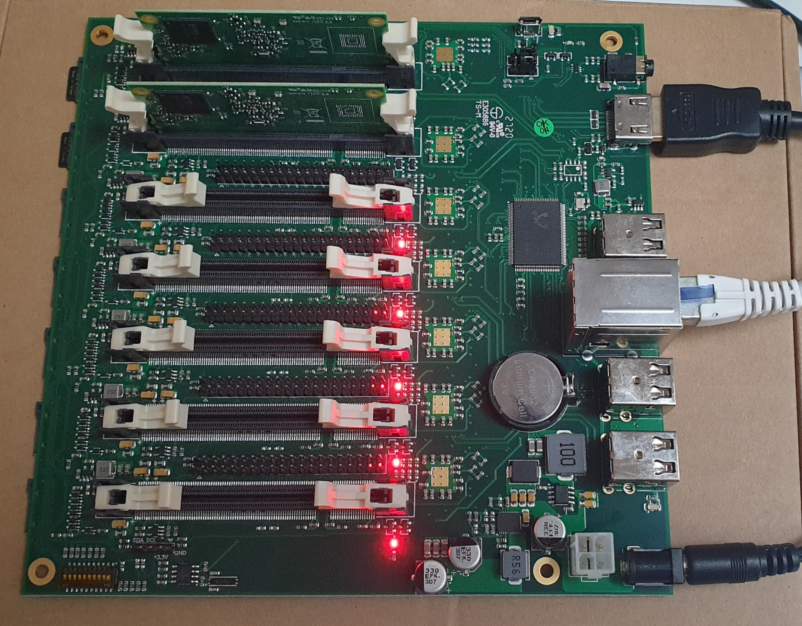

# TuringPI AFLplusplus Cluster Setup



Use setup playbook to configure the cluster: 
```$ ansible-playbook setup.yml -vvv -i inventory.yml```

Extended https://github.com/dinofizz/picluster-ansible to build AFLplusplus (fuzzer role).